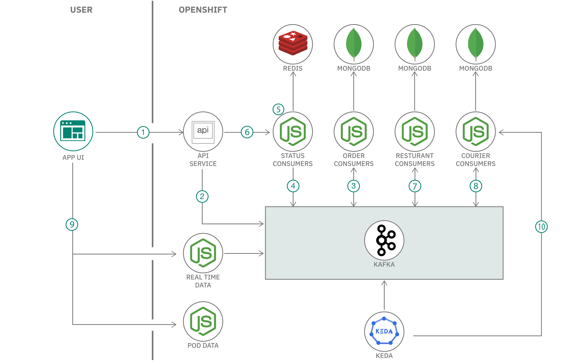
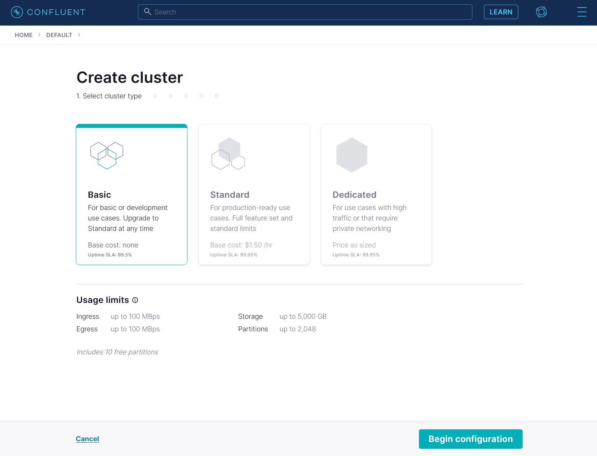
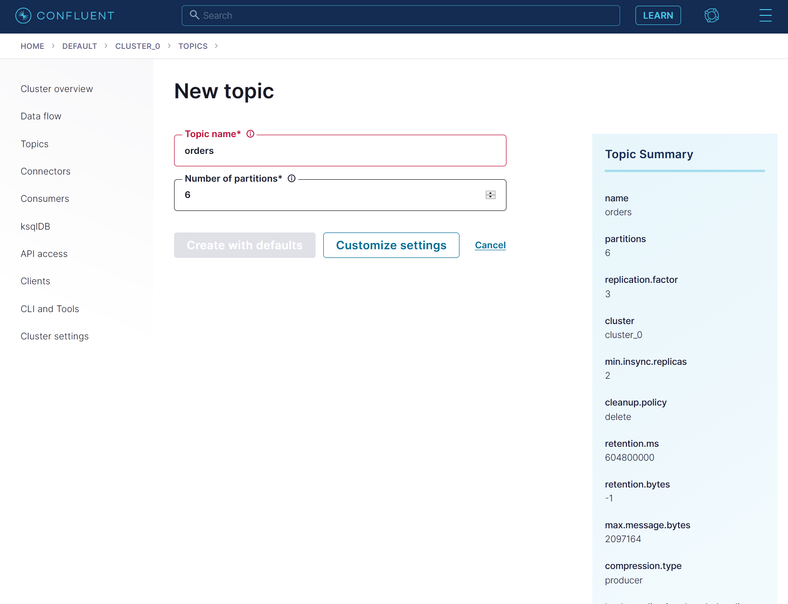
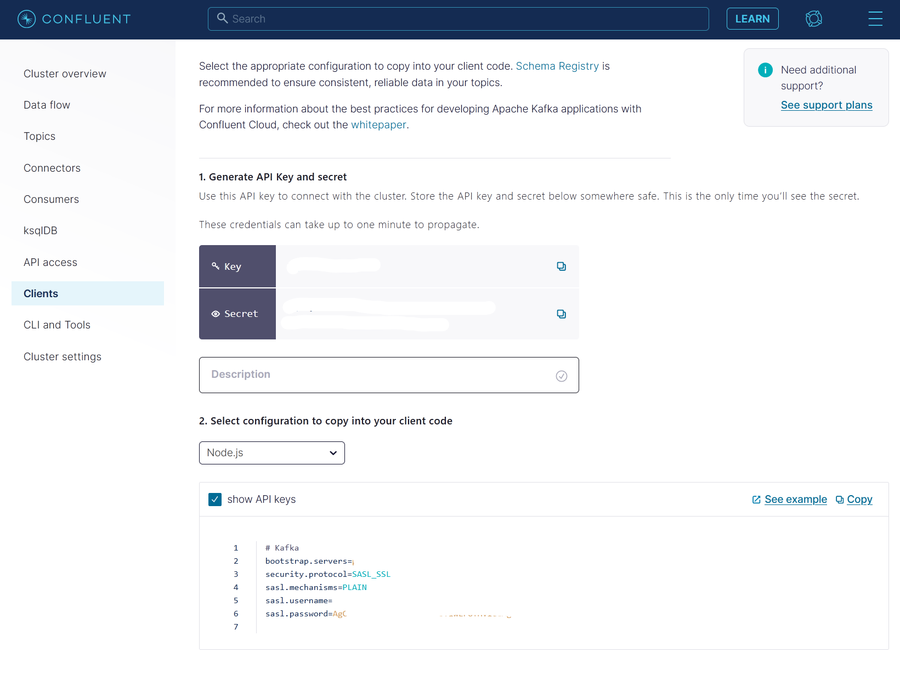
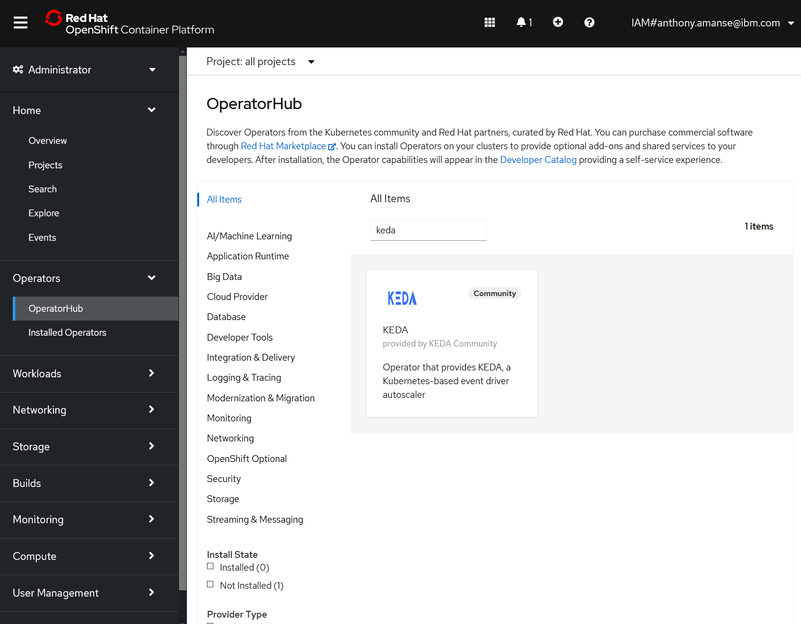
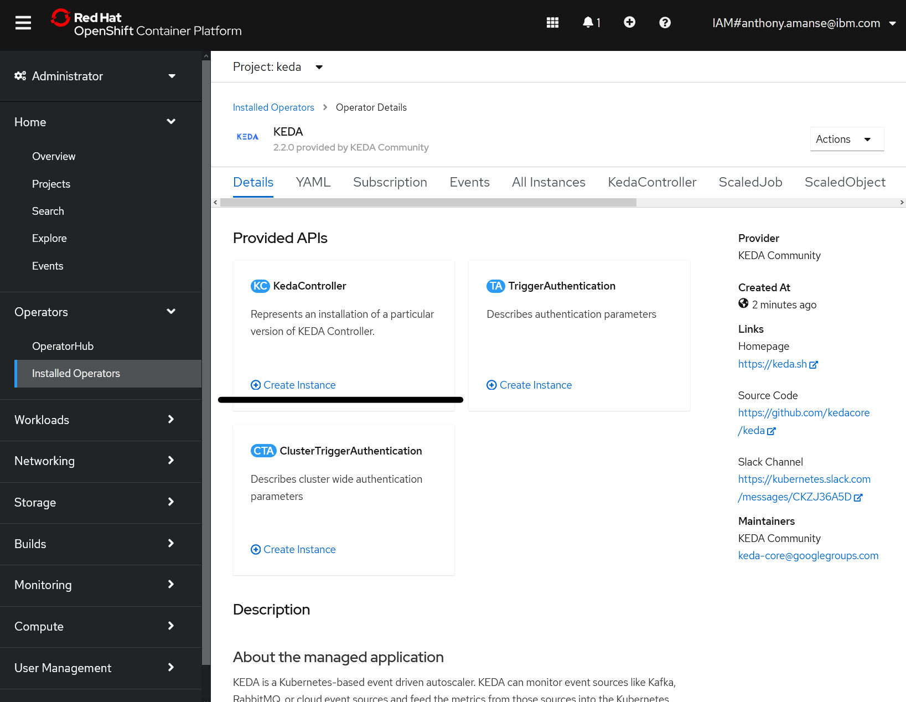
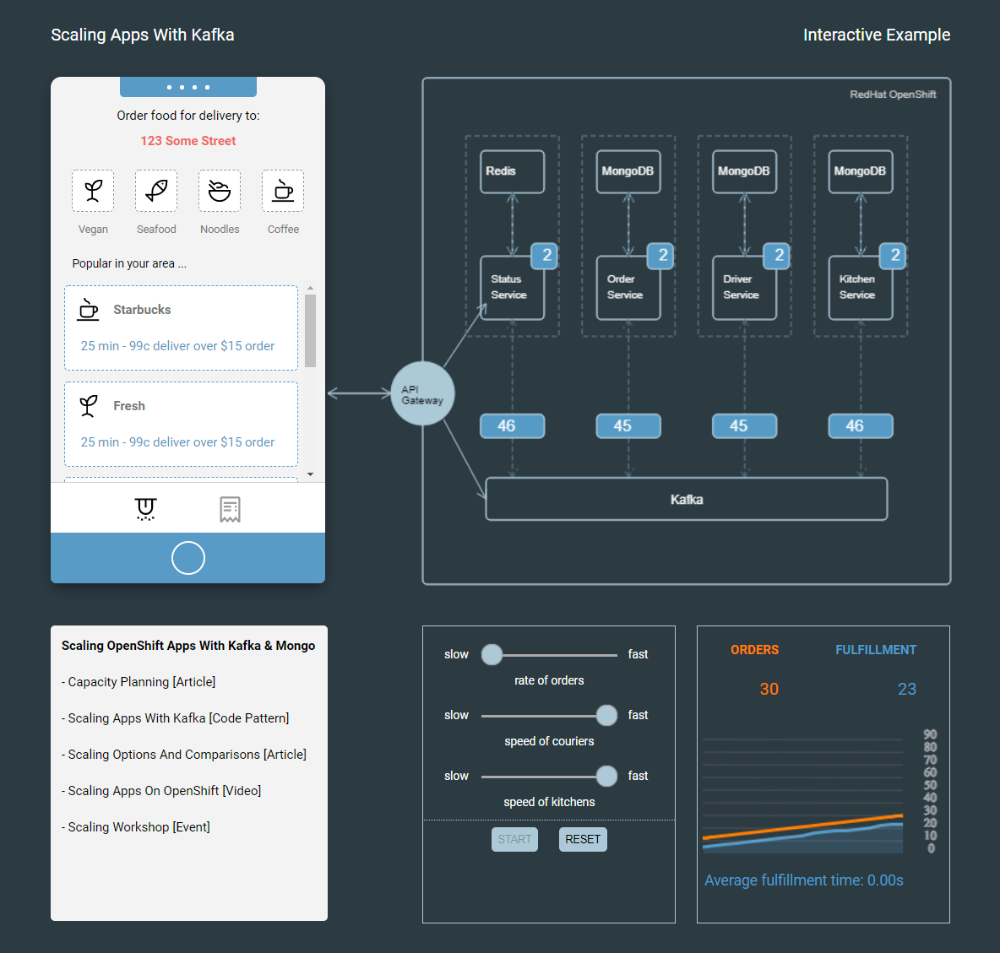
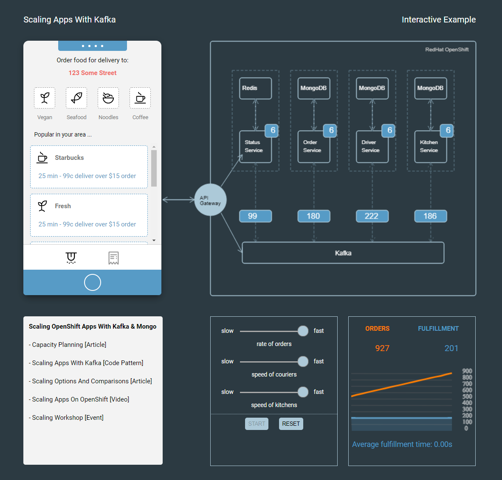

# scaling-apps-with-kafka
In this code pattern, you will deploy an example food delivery application that is using Kafka and OpenShift. The examle application is utilizing a Kafka topic to produce and consume records of orders. The application has multiple microservices that consume and process these records/messages. The architecture below will explain the roles of these microservices. To scale them based on the incoming messages instead of the default Horizontal Pod Autoscaler (HPA) that uses cpu and memory thresholds, you will us KEDA or Kubernetes Event-Driven Autoscaler.

With the KEDA operator, you can scale your OpenShift resources based on events. In the case of Kafka, you can scale them based on the consumer lag. Consumer lag is the difference between the most recent produced message and the current message that's consumed. If the consumer lag starts to grow, this usually means that the consumer is not able to keep up with the incoming records or messages in a Kafka topic. With KEDA, you can autoscale the number of consumers so that your group of consumers can consume and process more messages to try and keep up with the pace of incoming messages. [KEDA](https://keda.sh/) is an open source project and also supports more event sources besides Kafka.

When you have completed this code pattern, you will understand how to:

* Deploy microservices with Kafka integration
* Use KEDA or Kubernetes Event-driven Autoscaler
* Scale these microservices based on the consumer lag



## Flow

1. The user starts the simulator from the frontend. The simulator sends requests to the API service to create orders. The API service is using an asynchronous REST method. Requests get a correlation ID.
2. The API service produces the message to the Kafka topic.
3. The order consumer picks up the message and processes it. This service is responsible for validating the transaction. This microservice can also produce messages to tha Kafka topic
4. The status consumer consumes the message when it sees that the transaction is created and validated by the order consumer.
5. The status consumer updates the Redis databas with the result of the transaction. This result is keyed with the correlation ID. The status microservice is responsible for updating the REST requests' correlation ID with the response. It's also responsible for serving the API service for it to fetch the responses.
6. The frontend then polls for a response from the API service using the correlation ID. The API service fetches it from the status microservice.
7. The restaurant microservice is subscribed to the Kafka topic so restaurants know when to start preparing the order. It also produces a message so that the courier consumer knows when to pick it up.
8. The courier microservice is subscribed so it gets notified when the order is ready for pick up. It also produces a message when the order is complete so that the order consumer can update the transaction in its database.
9. The realtime data is subscribed to the Kafka topic so it can serve the events in the simulator's graph. The pod data is providing the data for the number of pods of the consumer microservices to the frontend's architecture image.
10. KEDA will scale the number of pods of the consumer microservices when it reaches a certain consumer lag that is set in the deployment.

# Prerequisites

* OpenShift cluster
* OpenShift CLI (oc)

Make sure you are logged in your target openshift cluster when you are doing `oc` commands in this code pattern.

# Steps

1. [Clone the repo](#1-clone-the-repo).
2. [Create and configure the Kafka service](#2-Create-and-configure-the-Kafka-service).
3. [Deploy the microservices](#3-Deploy-the-microservices).
4. [Install KEDA](#4-Install-KEDA)
5. [Deploy KEDA ScaledObjects](#5-Deploy-KEDA-ScaledObjects).
6. [Run the application](#6-Run-the-application).


### 1. Clone the repo

Clone the `scaling-apps-with-kafka` repo locally. In a terminal, run:

```bash
git clone https://github.com/IBM/scaling-apps-with-kafka
```

### 2. Create and configure the Kafka service

This code pattern uses a Kafka cluster in Confluent Cloud. You can get a free trial on their [website](https://www.confluent.io/confluent-cloud/).

In their platform, create a basic cluster for development.



Then create a topic named `orders` in the **Topics** tab. Use 6 partitions and leave the other configurations in default.



Then create an API Key in the **Clients** tab. Take note of the **Key** and **Secret**.



In the `deployments/kafka-secret.yaml` file, replace the **SASL_USERNAME** and **SASL_PASSWORD** with the **Key** and **Secret** respectively. Replace the BOOTSRAP_SERVERS with the value in `bootstap.servers` you got from above. You can also find this in the **Cluster Settings** tab.
```
...
  BOOTSTRAP_SERVERS: 'pkc-***.us-east4.gcp.confluent.cloud:9092'
  SECURITY_PROTOCOL: 'SASL_SSL'
  SASL_MECHANISMS: 'PLAIN'
  SASL_USERNAME: '****'
  SASL_PASSWORD: '***'
...
```

Then create the secret in your OpenShift cluster so your microservices can access the Kafka service.

```
oc apply -f deployments/kafka-secret.yaml
```

### 3. Deploy the microservices

> In this step you can either use the prebuilt images in the yaml files or you can build and push from source on your own Docker Hub. You can follow the instructions here to [build your own container images](building-container-images.md).

Create a project called `food-delivery` for you to deploy the microservices in.

```
oc new-project food-delivery
```

Then, deploy MongoDB and Redis instances. These instances are configured for development purposes only and don't have any persistence.

```
oc apply -f deployments/mongo-dev.yaml
oc apply -f deployments/redis-dev.yaml
```

Now you can deploy the microservices:

```
oc apply -f deployments/frontend.yaml
oc apply -f deployments/apiservice.yaml
oc apply -f deployments/statusservice.yaml
oc apply -f deployments/orderconsumer.yaml
oc apply -f deployments/kitckenconsumer.yaml
oc apply -f deployments/courierconsumes.yaml
oc apply -f deployments/realtimedata.yaml
oc apply -f deployments/podconsumerdata.yaml
```

Check their status using `oc get pods`. When all the pods are ready, you can now proceed in the next step.

### 4. Install KEDA

On your OperatorHub of your OpenShift console, locate and install KEDA operator to namespace `keda`. The operator will create the namespace for you if it doesn't exist. It may take a few minutes for it to completely install.



Then create a `KedaController` named `keda` in the namespace `keda` using the OpenShift console.



You can verify the installation using the command below. You should get a similar output.

```
oc get pods -n keda

### OUTPUT
NAME                                     READY   STATUS    RESTARTS   AGE
keda-metrics-apiserver-87dbd8f8b-zrj72   1/1     Running   0          25d
keda-olm-operator-59c5cbbddb-2f5r5       1/1     Running   0          25d
keda-operator-68d68b797-84qvb            1/1     Running   0          25d
```

### 5. Deploy KEDA ScaledObjects

Before deploying the ScaledObjects, create a `TriggerAuthentication` so that KEDA has access to your Kafka instance. Create it using the `deployments/keda-auth.yaml` yaml file:

```
oc apply -f deployments/keda-auth.yaml
```

This yaml file uses the `kafka-credentials` secret you created in Step 2.

You can now create the `ScaledObject` in `deployments/keda-scaler.yaml`. The `TriggerAuthentication` is referenced in this file. Create using the oc cli:

```
oc apply -f deployments/keda-scaler.yaml
```

In the ScaledObject definition, the `lagThreshold: '5'` is the consumer lag that scales the target deployment when it meets this threshold. You can read more about the Kafka scaler [here](https://keda.sh/docs/2.2/scalers/apache-kafka/)

To check the status of your scalers:

```
oc get scaledobjects

### OUTPUT:
NAME                     SCALETARGETKIND      SCALETARGETNAME   MIN   MAX   TRIGGERS   AUTHENTICATION                       READY   ACTIVE   AGE
courierconsumer-scaler   apps/v1.Deployment   courier           2     6     kafka      keda-trigger-auth-kafka-credential   True    False    23d
kitchenconsumer-scaler   apps/v1.Deployment   kitchen           2     6     kafka      keda-trigger-auth-kafka-credential   True    False    23d
orderconsumer-scaler     apps/v1.Deployment   orders            2     6     kafka      keda-trigger-auth-kafka-credential   True    False    23d
statusconsumer-scaler    apps/v1.Deployment   status            2     6     kafka      keda-trigger-auth-kafka-credential   True    False    23d
```

You should see the **READY** status values are **True**.

### 6. Run the application

To access the application, you're going to need to expose the frontend and the microservices that it will access.

Expose the frontend using the `oc` cli:

```
oc expose svc/example-food
```

Before exposing the backend service, get the hostname of the frontend and use that same hostname for your backend. To get the hostname of your frontend:

```
oc get route example-food -o jsonpath='{.spec.host}'

example-food-food-delivery.***.appdomain.cloud
```

Then modify `deployments/routes.yaml` file to use your hostname. Replace the instances of *HOSTNAME* in `host: HOSTNAME` with yours. For example: `host: example-food-food-delivery.***.appdomain.cloud`


Then apply the yaml file.

```
oc apply -f deployments/routes.yaml
```

The routes maps the URL paths to its intended target service. You can verify your routes using: `oc get routes`

You can now execute one of the APIs using the terminal. You should get a similar response. Replace the hostname in the command below:

```
curl -X POST -H "Content-Type: application/json" -d @restaurants.json http://YOUR_HOSTNAME/restaurants

### OUTPUT
{"requestId":"e2bdbb26-b8ba-406a-acbe-b10e2cfd599b","payloadSent":{"restaurants":[...]}}
```

This should populate the restaurants list in the frontend's mobile simulator.

You can now access the simulator in your browser with the hostname you got from above. (ex. example-food-food-delivery.***.appdomain.cloud). Check the sample output below to see what you can do with the simulator.

# Sample output

You can move the sliders in the bottom section to adjust the rate of orders and speed of kitchen and couriers. The number above the microservices is the number of pods or consumers. The number below is the number of messages being consumed.

Try setting it to the minimum rate of orders first. You should see the graph plot data points of orders created and orders fulfilled. At the same time, the number of pods should stay the same as the consumers can handle the 1 order per second.


Then, you can try and increase the rate of orders to the maximum. You should see the number of pods in the architecture image increase as well.


You can also use the mobile simulator to manually create orders.

## License

This code pattern is licensed under the Apache License, Version 2. Separate third-party code objects invoked within this code pattern are licensed by their respective providers pursuant to their own separate licenses. Contributions are subject to the [Developer Certificate of Origin, Version 1.1](https://developercertificate.org/) and the [Apache License, Version 2](https://www.apache.org/licenses/LICENSE-2.0.txt).

[Apache License FAQ](https://www.apache.org/foundation/license-faq.html#WhatDoesItMEAN)
