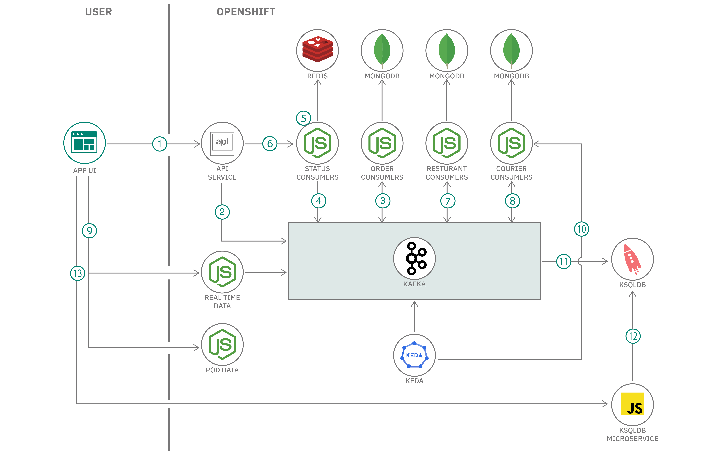
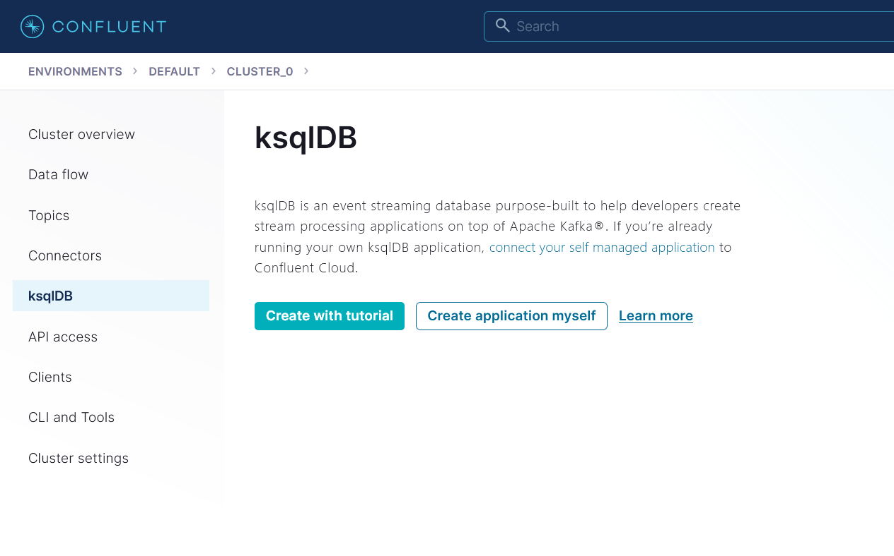
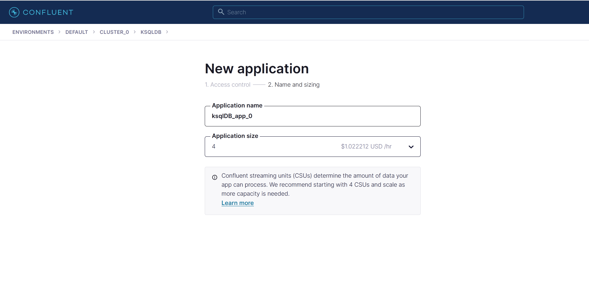
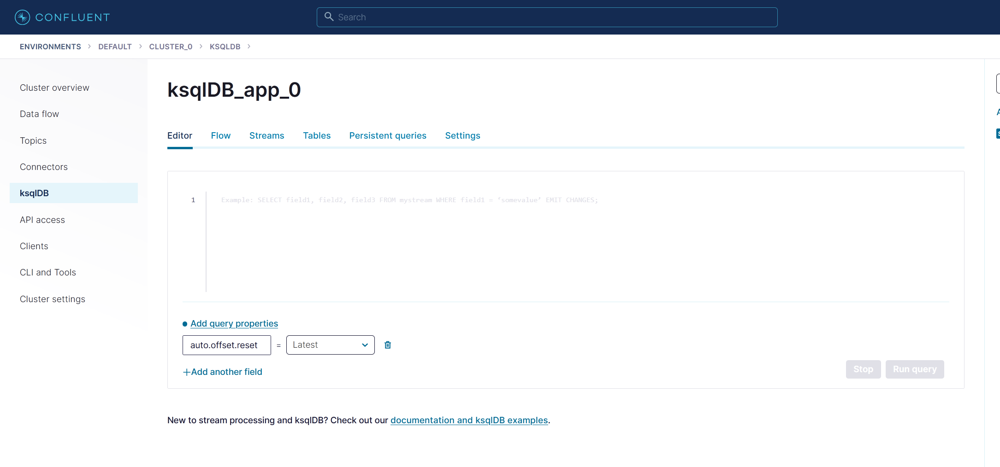
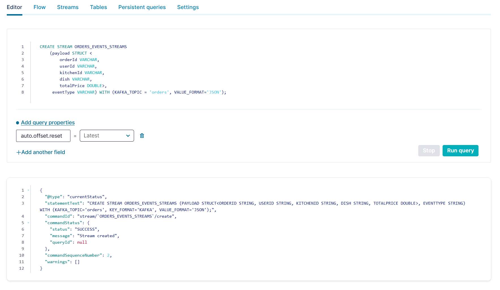
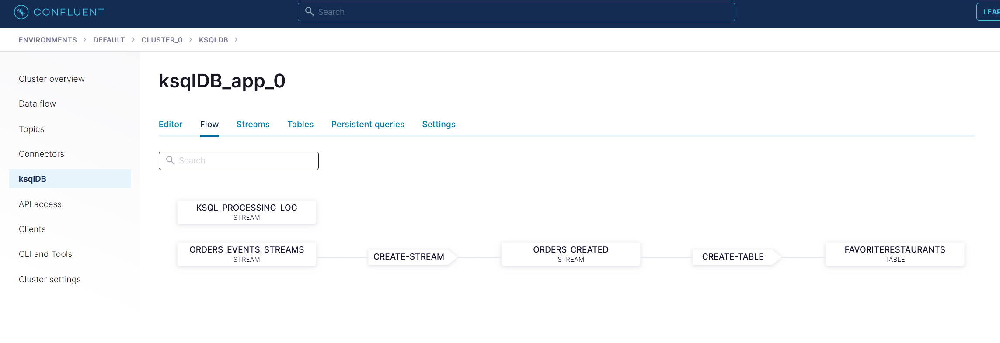
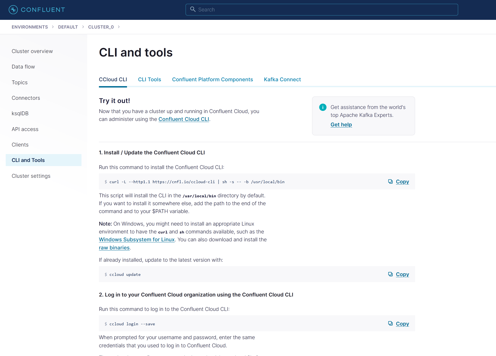
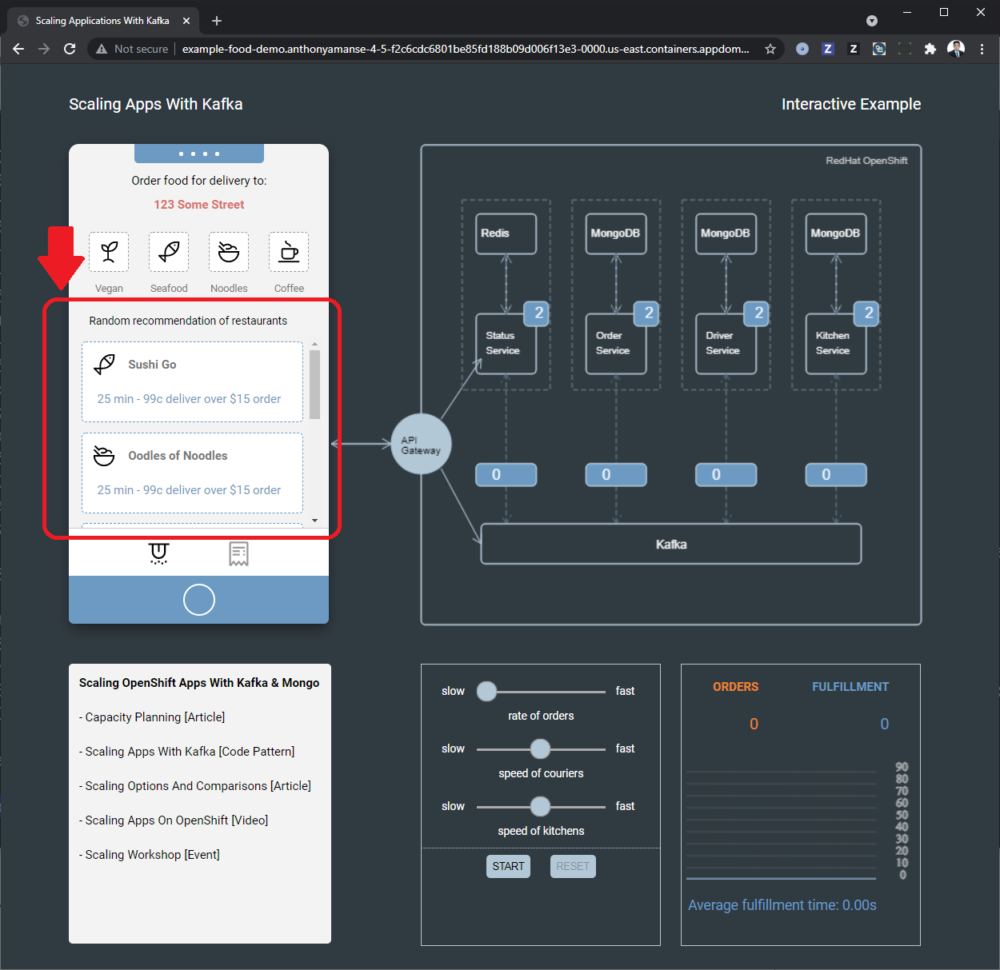
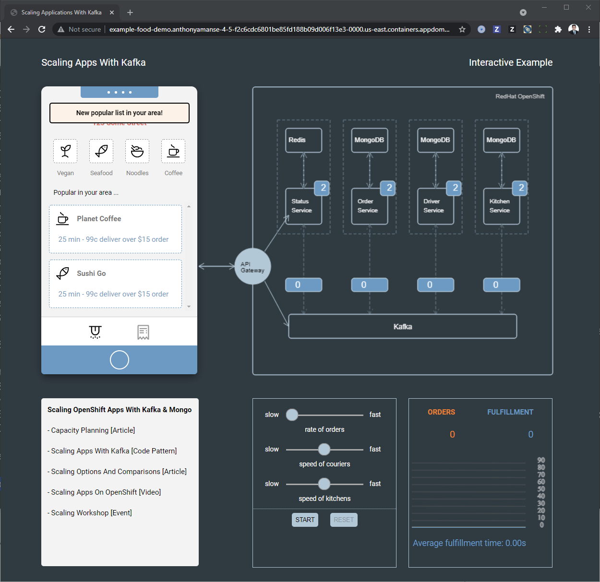

# Process streams and extract insights with ksqlDB

<!-- intro -->
The previous code pattern [Scaling an Event Driven architecture using an Event Driven autoscaler](https://github.com/IBM/scaling-apps-with-kafka/) walked you through creating a Kafka cluster and creating microservices to interact with it and deploy an example food ordering application. In this code pattern, you will extend that code pattern and create a [ksqlDB](https://ksqldb.io/). You will then create a microservice to connect to that ksqslDB and expose the data in it.

With the ksqlDB, you can easily process streams in your application. The ksqlDB leverages the existing Kafka cluster and add new capabilities in your applications. In this code pattern, you will add a new feature in the app that shows the most popular restaurants. The ksqlDB would then process the streams of orders to create that materialized view in real-time. A node.js is used to do [push queries](https://docs.ksqldb.io/en/latest/concepts/queries/#push) and expose that data to the UI in real-time.

When you have completed this code pattern, you will understand how to:

* Create a ksqlDB and create streams and tables
* Add new capabilities in an existing application
* Create a microservice to query the ksqlDB




## Flow

**1 - 10** in the architecture is the same in the previous code pattern [Scaling an Event Driven architecture using an Event Driven autoscaler](https://github.com/IBM/scaling-apps-with-kafka/).

11. Streams are created from the kafka topic. A table is also created to get the most popular restaurants.

12. A Node.js microservice is using the available REST API to do a push query in the "favorite restaurants" table.

13. The frontend UI is connected to the ksqlDB microservice using websockets. The UI is updated whenever there are new popular restaurants.

# Prerequisites

* OpenShift cluster
* OpenShift CLI (oc)

Make sure you are logged in your target openshift cluster when you are doing `oc` commands in this code pattern.

# Steps

1. [Complete previous code pattern](#1-Complete-previous-code-pattern).
2. [Create and configure ksqlDB](#2-Create-and-configure-ksqlDB).
3. [Execute KSQL statements](#3-Execute-KSQL-statements).
4. [Build microservice that exposes data from ksqlDB](#4-Build-microservice-that-exposes-data-from-ksqlDB)
5. [Create ksqlDB credentials then deploy microservice](#5-Create-ksqlDB-credentials-then-deploy-microservice).
6. [Run the application](#6-Run-the-application).

### 1. Complete previous code pattern

This code pattern extends the [Scaling an Event Driven architecture using an Event Driven autoscaler](https://github.com/IBM/scaling-apps-with-kafka/). Complete that code pattern before proceeding to the next step.

### 2. Create and configure ksqlDB

* Select your Kafka cluster and go to **ksqlDB** section



* Choose **Create application myself** then **Global Access** for access control. Name your ksqlDB and choose **4 streaming units**



### 3. Execute KSQL statements

Once you have created the ksqlDB application, you may need to wait for it to get provisioned. It could take 5 to 10 minutes. Once provisioned, click on your provisioned ksqlDB then you can now use the editor and execute the ksql statements below.



* Create a Stream for the orders topic

```
CREATE STREAM ORDERS_EVENTS_STREAMS
	(payload STRUCT <
     	orderId VARCHAR,
     	userId VARCHAR,
     	kitchenId VARCHAR,
     	dish VARCHAR,
     	totalPrice DOUBLE>,
     eventType VARCHAR)	WITH (KAFKA_TOPIC = 'orders', VALUE_FORMAT='JSON');
```



* Create a Stream where we only get records of an *orderCreated* event.

```
CREATE STREAM ORDERS_CREATED AS
	SELECT PAYLOAD->orderId AS orderId,
    	PAYLOAD->userId AS userId,
        PAYLOAD->kitchenId AS kitchenId,
        PAYLOAD->dish AS dish,
		CONCAT_WS('||',PAYLOAD->kitchenId, PAYLOAD->dish) AS kitchendishkey,
        PAYLOAD->totalPrice AS totalPrice
    FROM ORDERS_EVENTS_STREAMS WHERE EVENTTYPE='orderCreated';
```

* Create a Table to get favorite restaurants based on the stream above.

```
CREATE TABLE favoriteRestaurants AS
    SELECT kitchenId, COUNT() AS count
    FROM ORDERS_CREATED GROUP BY kitchenId;
```

* Verify the streams and table created in the **Flow** tab. It should look like below:



### 4. Build microservice that exposes data from ksqlDB

To expose the data from ksqlDB, you would need a microservice that fetches data from your ksqlDB. The source code is in `microservices/ksqlcontroller`. The microservice is using Node.js and utilizes the available http/2 [REST API](https://docs.ksqldb.io/en/0.18.0-ksqldb/developer-guide/api/) client.

You can build the container image using Docker:

```
docker build -t YOUR_DOCKER_USERNAME/ksqlcontroller:1.0 microservices/ksqlcontroller

docker push YOUR_DOCKER_USERNAME/ksqlcontroller:1.0
```

### 5. Create ksqlDB credentials then deploy microservice

For this step, you will need to use the Confluent Cloud CLI `ccloud`. You can find the binaries in the **CLI and Tools** section in your Confluent Cloud dashboard. Once you have installed it, you can proceed with the commands below.



* Login with your Confluent Cloud account.

```
ccloud login
```

* List your ksqlDB application, you will need your **endpoint** and **id**.

```
ccloud ksql app list -o json

[
  {
    "endpoint": "https://pksqlc-***.***.confluent.cloud:443",
    "id": "lksqlc-***",
    "kafka": "lkc--***",
    "name": "ksqlDB_app_0",
    "status": "UP",
    "storage": "500",
    "topic_prefix": "pksqlc-***"
  }
]
```

* Create an api key for your ksqlDB app. Replace **YOUR_KSQLDB_APP_ID** with the the one you got from the command above.

```
ccloud api-key create --resource YOUR_KSQLDB_APP_ID

It may take a couple of minutes for the API key to be ready.
Save the API key and secret. The secret is not retrievable later.
+---------+------------------------------------------------------------------+
| API Key | YOUR_API_KEY                                                 |
| Secret  | YOUR_SECRET |
+---------+------------------------------------------------------------------+
```

* Take note of the API key and Secret. Go to your `deployments/ksqlcontroller.yaml` and replace the values with your own. You can get the value for **KSQL_ENDPOINT** from the command `ccloud ksql app list -o json` you did above.

* In the same yaml file, replace the image `- image: ` with the one you just built in step 5.

* You can finally deploy the microservice.

```
oc apply -f deployments/ksqlcontroller.yaml
```

### 6. Run the application

Now, you can go back to the example applications frontend. You can find the URL again using the command below:

```
oc get route example-food -o jsonpath='{.spec.host}'

example-food-food-delivery.***.appdomain.cloud
```

Initally, you'll find a random list of restaurants in the mobile simulator like the one below:



Choose one of those restaurants and create an order. Since we added a new microservice that leverages ksqlDB, the application should now show favorite restaurants. The image below shows an example output:


You can choose another restaurant in one of the categories "Vegan, Seafood, Noodles, Coffee". Make sure to choose a new restaurant. After a few seconds, the mobile simulator should show the new restaurant in its list.



## License

This code pattern is licensed under the Apache License, Version 2. Separate third-party code objects invoked within this code pattern are licensed by their respective providers pursuant to their own separate licenses. Contributions are subject to the [Developer Certificate of Origin, Version 1.1](https://developercertificate.org/) and the [Apache License, Version 2](https://www.apache.org/licenses/LICENSE-2.0.txt).

[Apache License FAQ](https://www.apache.org/foundation/license-faq.html#WhatDoesItMEAN)
