# Deploying an example scenario with Event Endpoint Management in OpenShift

The previous code pattern [Scaling an Event Driven architecture using an Event Driven autoscaler](https://github.com/IBM/scaling-apps-with-kafka/) walked you through creating a Kafka cluster and creating microservices to interact with it and deploy an example food ordering application. In this code pattern, you will use that code pattern and explore a scenario where you can use Event Endpoint Management.

In the same way that API Management enable you to make APIs easier to discover, subscribe to and use, Event Endpoint Management does the same thing for events.

This code pattern explores a scenario where you have 3 entities:

**A)** the **event producer** who owns the Kafka topic. This entity describes and documents their stream of events in the topic and publishes this in a catalog where others can discover and subscribe to it.

**B)** The **external app developer** who will subscribe to that published event stream. This entity will use the API Developer Portal to subscribe to that stream and uses it to get its own credentials for it to access the stream in its own application.

**C)** The final entity is a **restaurant system administrator**, the user of the external app developer's application. In this example code pattern, this entity uses that application to set up webhooks so that its restaurant can be integrated and receive notifications whenever an order is created for its restaurant.

With Event Endpoint Management, this allows an organization or an entity to share its stream of events in a Kafka topic and manage this.

Event Endpoint Management is included in [Cloud Pak for Integration](https://www.ibm.com/cloud/cloud-pak-for-integration), and builds on the existing API management componentry to enable event interfaces to be combined with traditional APIs. You can view a demonstration of the Event Endpoint Management capability [here](https://community.ibm.com/community/user/integration/blogs/dale-lane1/2021/06/27/a-demo-of-event-endpoint-management).

In this code pattern we will focus on exposing just a Kafka topic, but it is worth pointing out that the target is to enable exposure of [“multi-form APIs”](https://www.ibm.com/cloud/blog/multi-form-api-management-is-it-an-api-or-not). These might for example include RESTful APIs, Kafka topics, and GraphQL, all under one roof. This enables the consumer to choose the interaction pattern most suited to their use case.

When you have completed this code pattern, you will understand how to:

* Share a Kafka Topic with Event Endpoint Management
* Subscribe to the Event Endpoint AsyncAPI
* Integrate an application to use the Event Endpoint


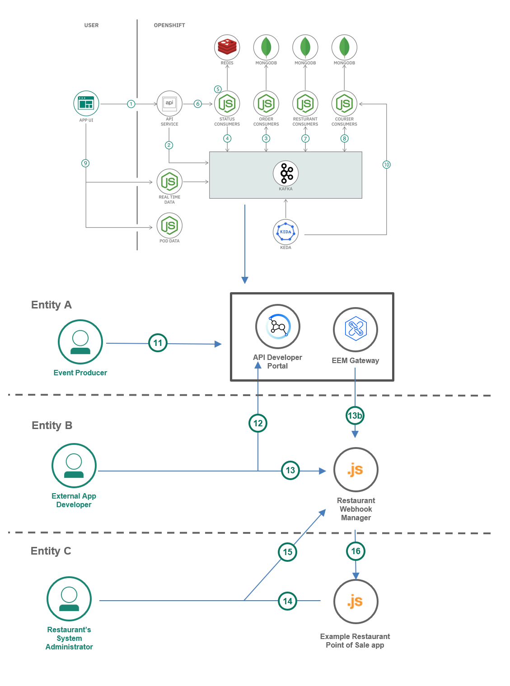

## Flow

**1 - 10** in the architecture is the same in the previous code pattern [Scaling an Event Driven architecture using an Event Driven autoscaler](https://github.com/IBM/scaling-apps-with-kafka/). This will provide us with a Kafka topic containing the events we want to expose.

11.	The event producer entity generates an AsyncAPI definition based on the Kafka topic. They publish this to the Event Endpoint Manager portal so that the external app developer can discover it.

12.	The external app developer entity discovers and subscribes to the AsyncAPI, enabling it to create a connection to the Kafka topic through the event endpoint gateway.

13. The external app developer deploys its finished app that connects the AsyncAPI endpoint.

14. Another entity, the system administrator of an example restaurant sets up its own environment for its point of sale system.

15. The system administrator uses the external app developer's application to set up its webhook so that it gets notifications for whenever its restaurant gets orders.

16. The restaurant's point of sale system gets notifications from the external app developer's app through webhooks being sent.

# Prerequisites

* OpenShift cluster **(Tested with IBM Cloud and AWS)**
* OpenShift CLI (oc)
* Kafka service **(Tested with IBM Event Streams and Confluent)**
* Cloud Pak for Integration **(with Event Endpoint capability)**

Make sure you are logged in your target openshift cluster when you are doing `oc` commands in this code pattern.

# Steps

1. [Clone the repo](#1-clone-the-repo).
2. [Configure Event Endpoint Management](#2-Configure-Event-Endpoint-Management).
3. [Subscribe to Event Endpoint AsyncAPI](#3-Subscribe-to-Event-Endpoint-AsyncAPI).
4. [Create Secrets](#4-Create-Secrets)
5. [Deploy the microservices](#5-Deploy-the-microservices).
6. [Run the application](#6-Run-the-application).


### 1. Clone the repo

Clone the `scaling-apps-with-kafka` repo locally and go to the `eem` directory. In a terminal, run:

```bash
git clone https://github.com/IBM/scaling-apps-with-kafka

cd microservices/eem
```

### 2. Configure Event Endpoint Management
This code pattern assumes you already have an API Manager with Event Endpoint capabilities or a standalone Event Endpoint Manager in your [Cloud Pak for Integration](https://www.ibm.com/cloud/cloud-pak-for-integration) installation.

First, we will take the role of the Event Producer entity. We will to go to the API Manager dashboard and add an AsyncAPI:
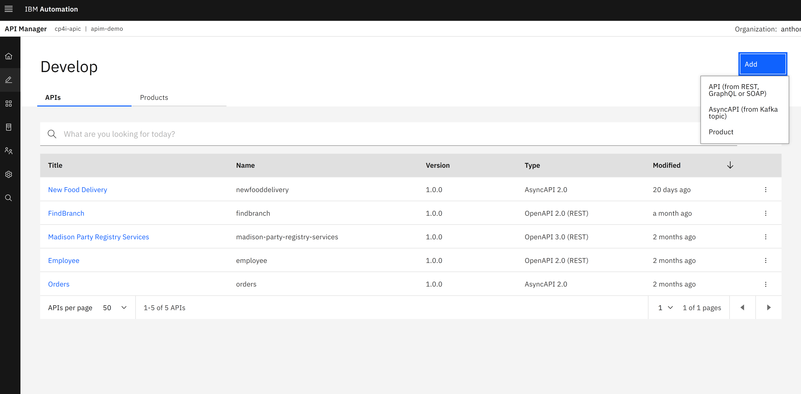

Configure it with your own Kafka instance. This code pattern has been tested with [IBM Event Streams](https://www.ibm.com/cloud/event-streams) service and also with Confluent. You can name it `Example Food Delivery` for this code pattern.
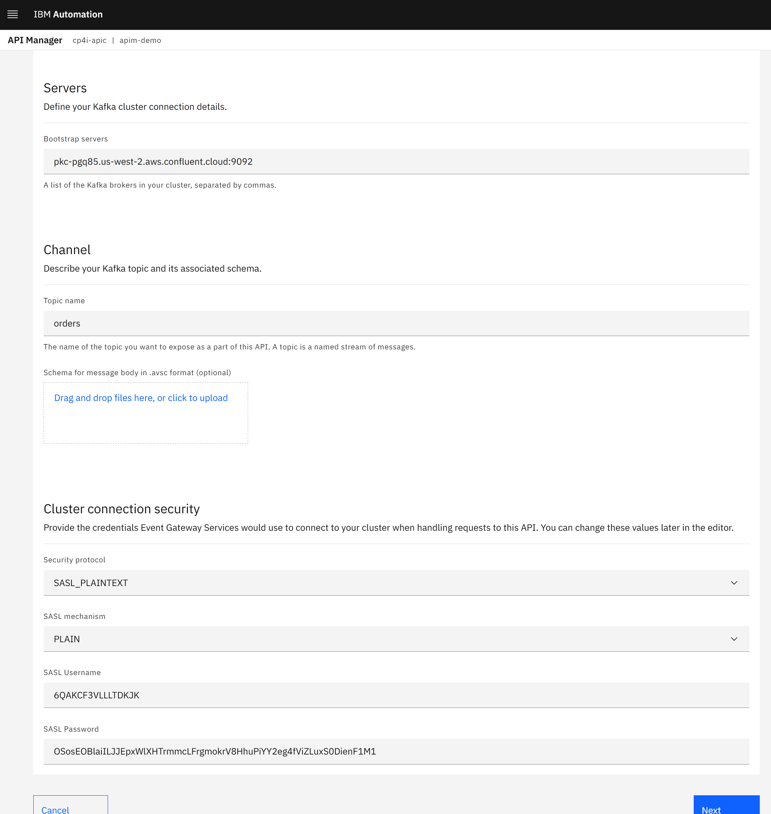

Click on **Next** then check the `Publish this API:` so the API management capability will create an API “product” for you and automatically publish this in the API portal.
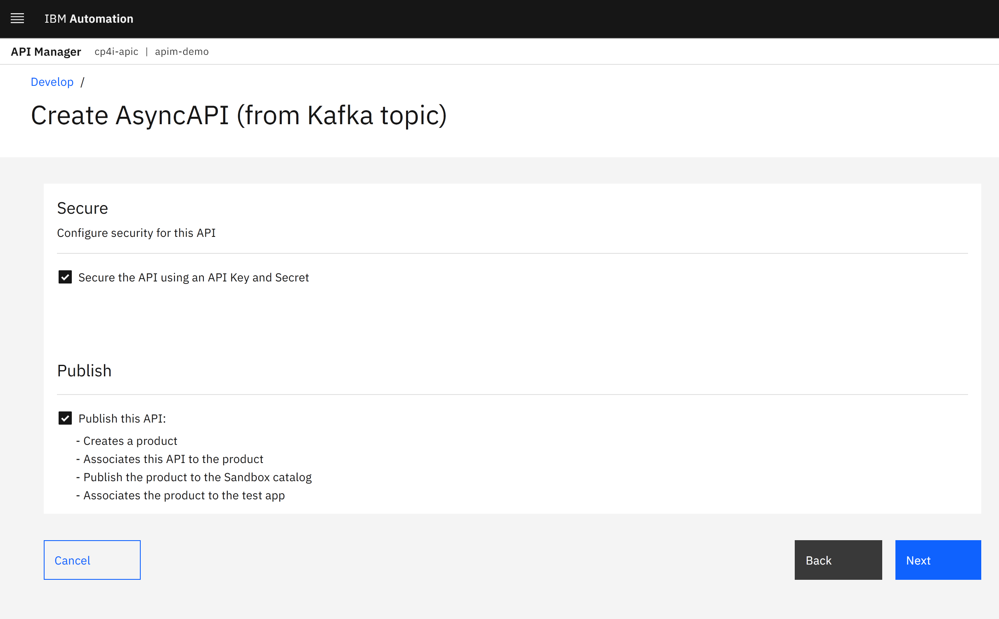

You should see a summary of your AsyncAPI similar to the image below.
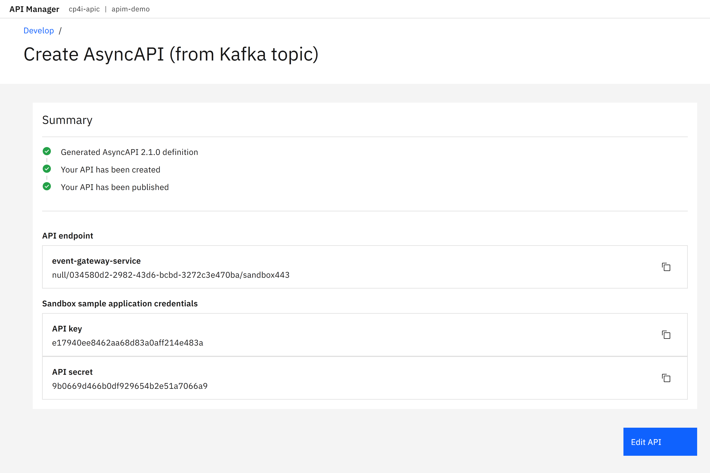

### 3. Subscribe to Event Endpoint AsyncAPI
Next we will take on the roll of the “external app developer” and subscribe to the Event Endpoint. We will need to use the API Developer Portal to discover the API. Make sure you're logged in.
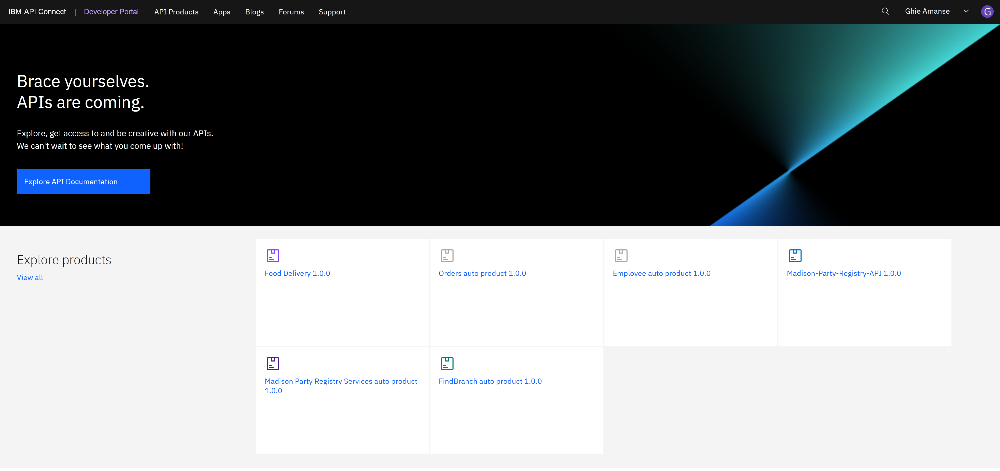

Click on the `API Products` page. You should be able to see the product that was automatically created for the AsyncAPI from the previous step. Click on that one.
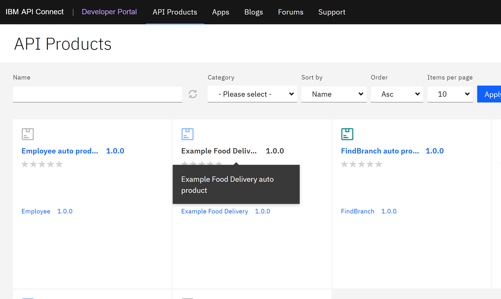

From the `Plans` section, click the `Select` button to subscribe to it.
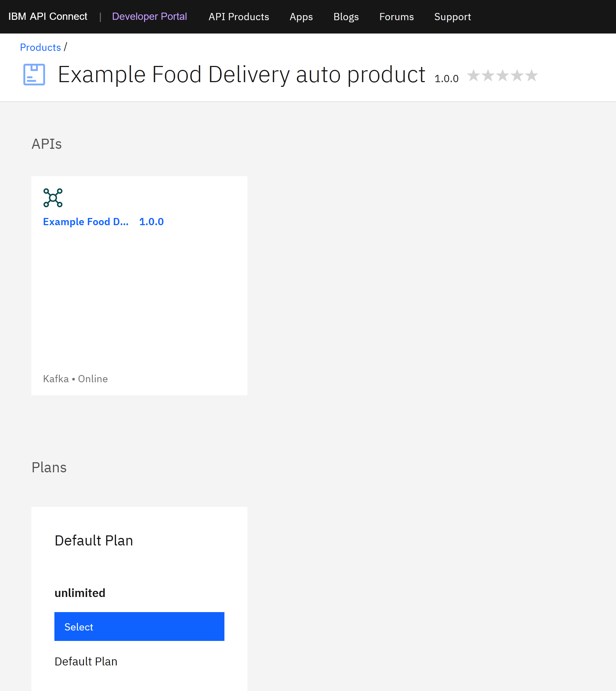

Select the `Create application` to make your application known to the API management and get the details needed to subscribe to the topic. Once created you should see your `Key` and `Secret` that your application can use to retrieve events. **Take note of this for the next step. Copy it somewhere in your text editor**. Proceed with the subscription prompts by selecting your newly created app.
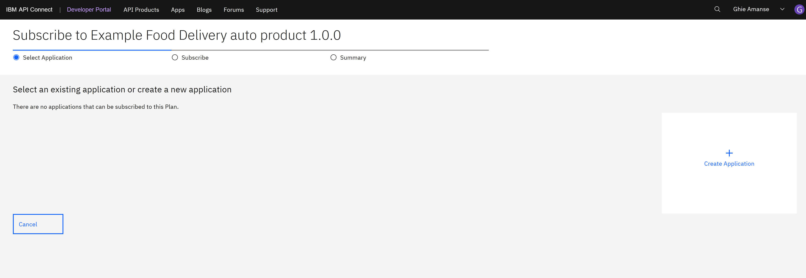
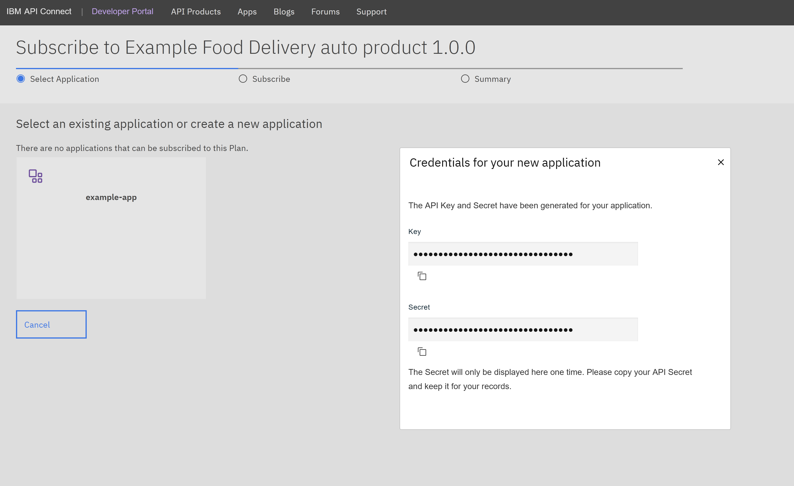
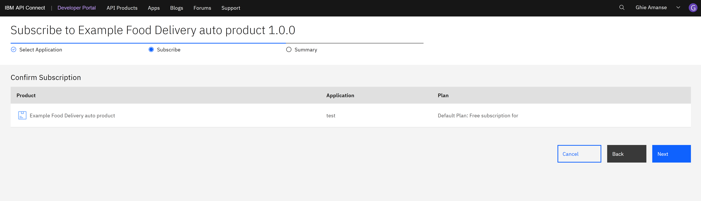

Then back in the Products section, select the AsyncAPI to view its endpoint.
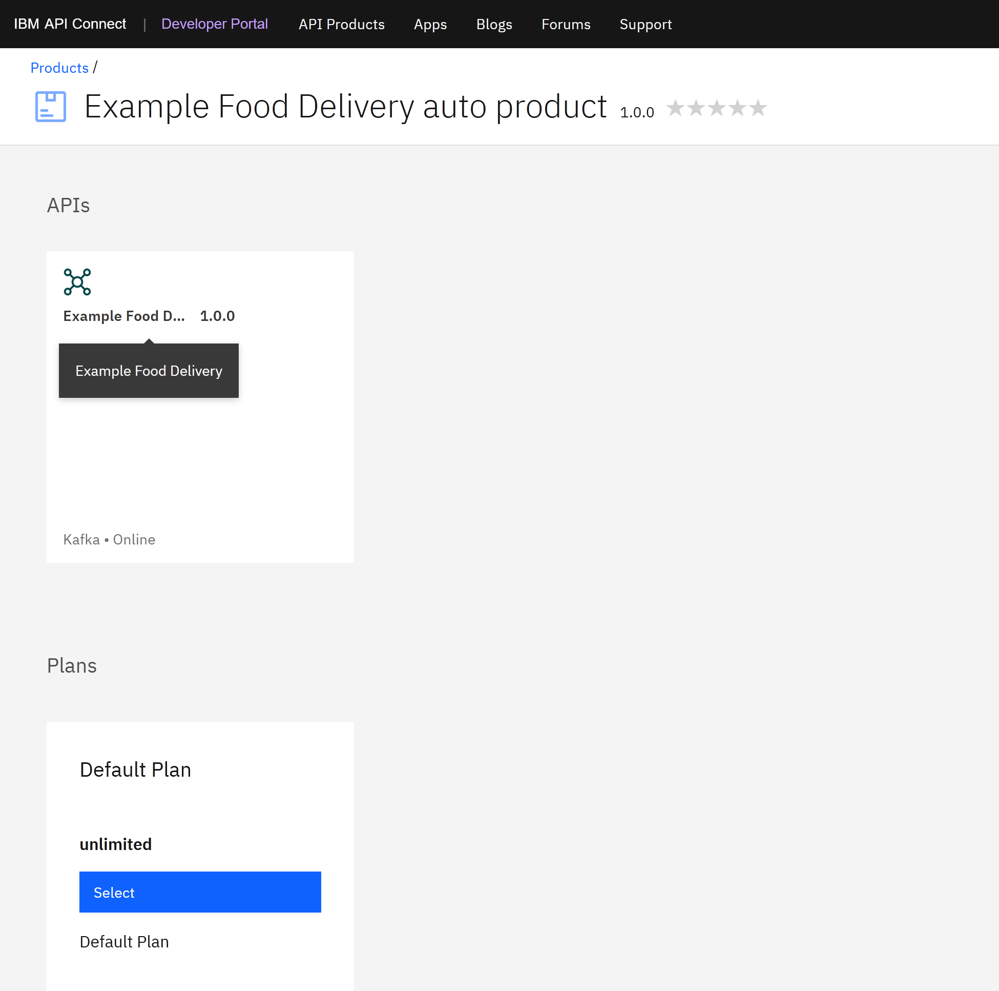

Take note of the `Endpoint` value you get similar to the screenshot above. _The value from the example above is `apim-demo-egw-event-gw-client-cp4i-apic.apps.biggs.coc-ibm.com:443`_. Copy it somewhere in your text editor as you will also need this for the next step.

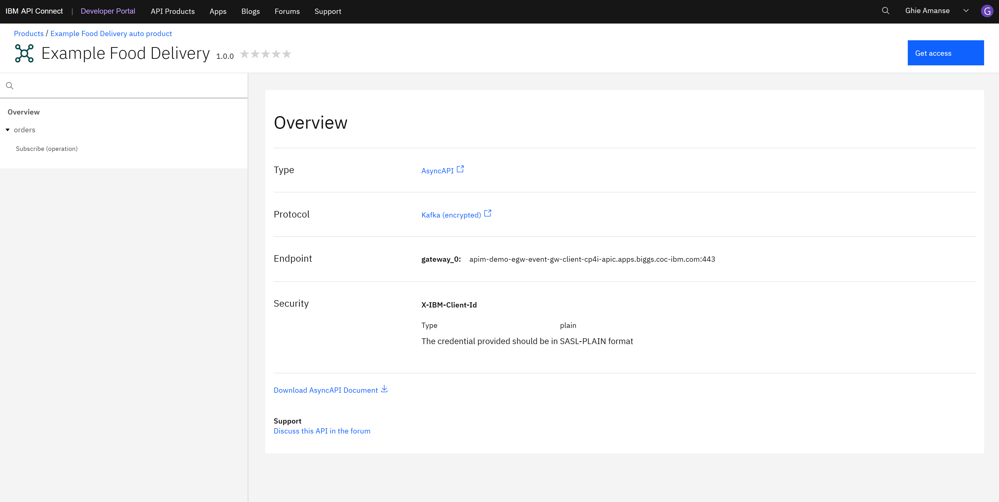

Then, you will also need the client ID. You can get this by going to the `orders` > `Subscribe (operation)` from the API product page. On the `Properties` section, you can find your client ID in `client.id`. Take note of this as well for the next step.

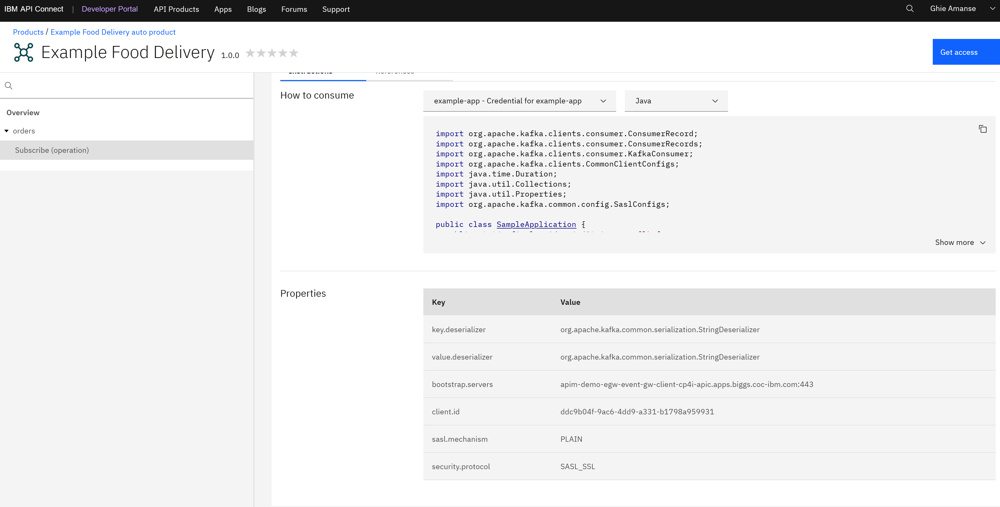

### 4. Create Secrets

For this step, you should already have an `Endpoint`,`Key`, `Secret`, `ClientID` values. In `asyncapi-secret.yaml`, replace the values of `BOOTSTRAP_SERVERS`, `SASL_USERNAME`, `SASL_PASSWORD`, `CLIENT_ID` with your values respectively. Example is provided below:

```
## example asyncapi-secret.yaml
...
  stringData:
    BOOTSTRAP_SERVERS: 'apim-demo-egw-event-gw-client-cp4i-apic.apps.biggs.coc-ibm.com:443'
    SASL_USERNAME: 'e8d56f43aa5f39aaabe363d3f943f95f'
    SASL_PASSWORD: '678c7105c2c7c3fd4555df0c35197164'
    CLIENT_ID: 'ddc9b04f-9ac6-4dd9-a331-b1798a959931'
...
```

Create the secret using the oc cli:
```
oc create -f asyncapi-secret.yaml
```

> If you have a self signed certificate, proceed below. If not, you can continue on Step 5.

If you have a self signed certificate for your event gateway, you will need to get and pass the CA certificate for the microservice in the next step to connect properly.


To check if you have a self signed certificate, you can use the `openssl` command in your terminal:

```
openssl s_client -connect <event-gateway>:443 -servername <event-gateway-domain-name>
```

If it's self signed, it should show in the output like the one below:

```
...
---
Server certificate
-----BEGIN CERTIFICATE-----
........redcated...........
-----END CERTIFICATE-----
...
---
SSL handshake has read 1296 bytes and written 447 bytes
Verification error: self signed certificate
---
...
```

Copy the certificate from the output above. Copy the lines from `BEGIN CERTIFICATE` to `END CERTIFICATE` and create a file for it named `ca.pem`.

```
oc create secret generic event-gateway-ca --from-file=ca.pem
```

Then **uncomment the lines 22-23, and 27-37** in the `eem-subscriber.yaml` file.

You can now proceed to deploying the microservices in the next step.

### 5. Deploy the microservices
In this step you can either use the prebuilt images in the yaml files or you can build and push from source on your own Docker Hub. You can follow the instructions here to [build your own container images](building-container-images.md).

Modify the environment variable `BACKEND_URL` in `eem-subscriber.yaml` to use the backend URL from the previous [Scaling an Event Driven architecture using an Event Driven autoscaler](https://github.com/IBM/scaling-apps-with-kafka/) code pattern (Refer to the route you got in [Step 6](https://github.com/IBM/scaling-apps-with-kafka/#6-run-the-application) in that code pattern). Then, you can now deploy the microservice that will consume the Event Endpoint Management connection.

```
oc apply -f eem-subscriber.yaml
```

Then deploy the microservice that has a webhook for an example restaurant's system or point of sale.

```
oc apply -f example-restaurant-pos.yaml
```

Expose both applications with OpenShift routes:
```
oc expose svc/external-app-eem-subscriber
http://external-app-eem-subscriber-food-delivery.***.cloud

oc expose svc/example-restaurant-pos
http://example-restaurant-pos-food-delivery.***.cloud
```

Take note of these URLs for the next step.

### 6. Run the application

Now, you can run the external app developer's app `external-app-eem-subscriber` and use that to set a webhook for a restaurant. In your browser, open the route for the `external-app-eem-subscriber` + `/dashboard` path that you got from the previous step (ex. `http://<route>/dashboard`). Select one of the restaurants, and then for the webhook, use the route of the `example-restaurant-pos` with the path `/callback` (ex. `http://<route>/callback`).

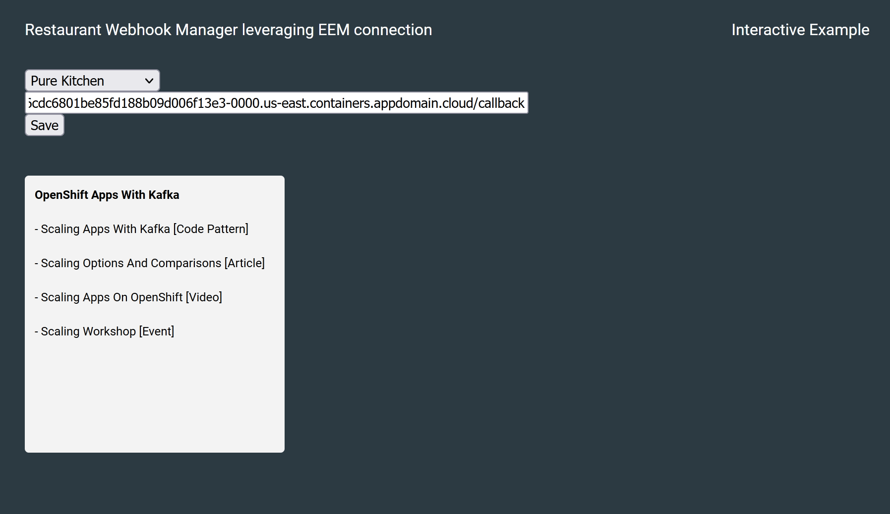

Open the route for the `example-restaurant-pos`. It should show a blank dashboard at first.

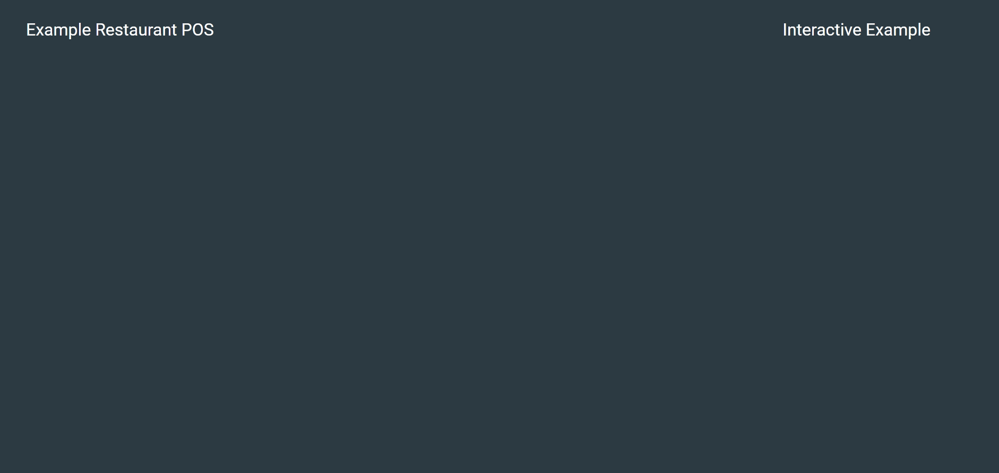

Go to the previous code pattern's application [Scaling an Event Driven architecture using an Event Driven autoscaler](https://github.com/IBM/scaling-apps-with-kafka/) ([Step 6](https://github.com/IBM/scaling-apps-with-kafka/#6-run-the-application)) and then **create an order in the same restaurant you chose to set a webhook for**. This way, the external app developer's `external-app-eem-subscriber` app would pick that event up and know which webhook to send a notification to. Then, the restaurant's `example-restaurant-pos` dashboard should show this like in the example below:

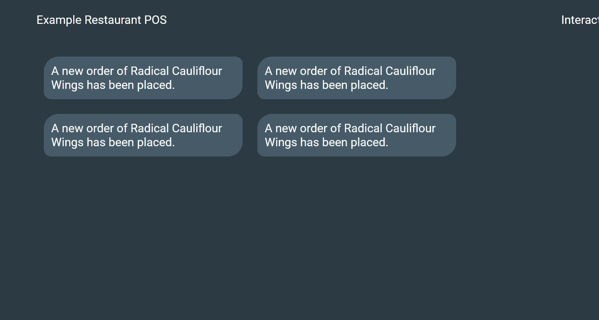

## License

This code pattern is licensed under the Apache License, Version 2. Separate third-party code objects invoked within this code pattern are licensed by their respective providers pursuant to their own separate licenses. Contributions are subject to the [Developer Certificate of Origin, Version 1.1](https://developercertificate.org/) and the [Apache License, Version 2](https://www.apache.org/licenses/LICENSE-2.0.txt).

[Apache License FAQ](https://www.apache.org/foundation/license-faq.html#WhatDoesItMEAN)
